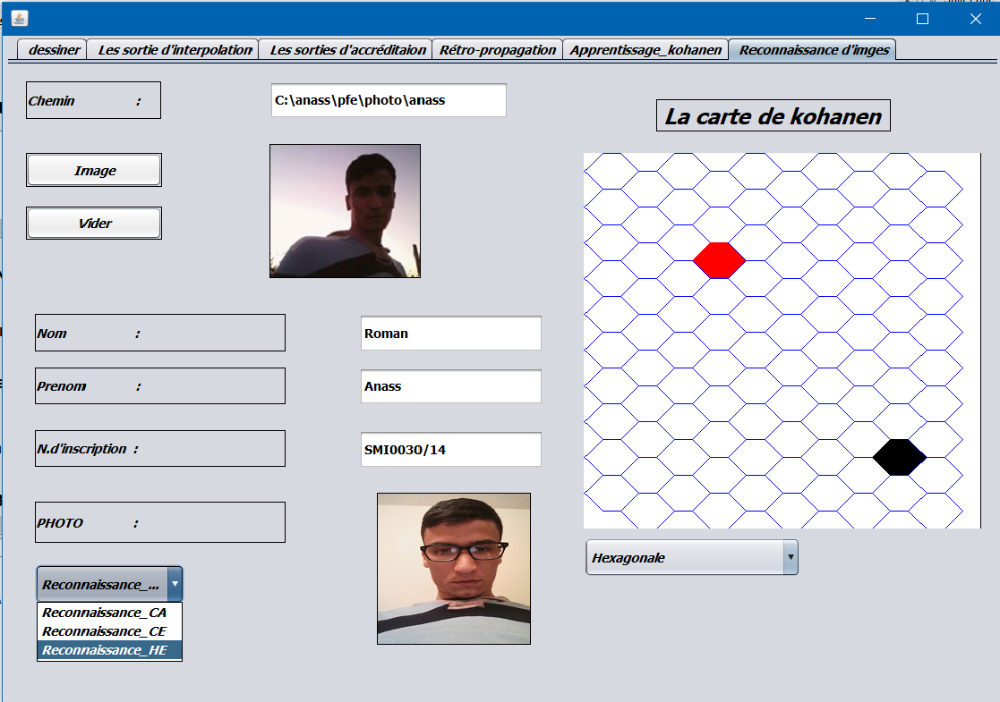

# Exemple-d-application-de-la-carte-de-kohanen-pour-la-reconnaissance-d-images

## Intro/Objectif du projet
Implémentation d’un algorithme de réseaux de neurones artificiels mono couche appelé la carte de Kohanen pour la reconnaissance
de visage, L’application a été développé avec JAVA OOP et JAVA SWING.

## Captures d'écran du projet
---

### la carte de kohanen :
-------------------------

#### l'apprentissage de Modèle

#### Visualiser les résultats :

##### coller le chemin de la photo et cliquer sur le bouton image :

##### cliquer sur le neurone rouge pour Visualiser les résultats :

***

### réseau de neurones à rétropropagation :
-------------------------------------------

#### l'apprentissage de Modèle : 

#### cliquer sur afficher pour Visualiser les résultats :

